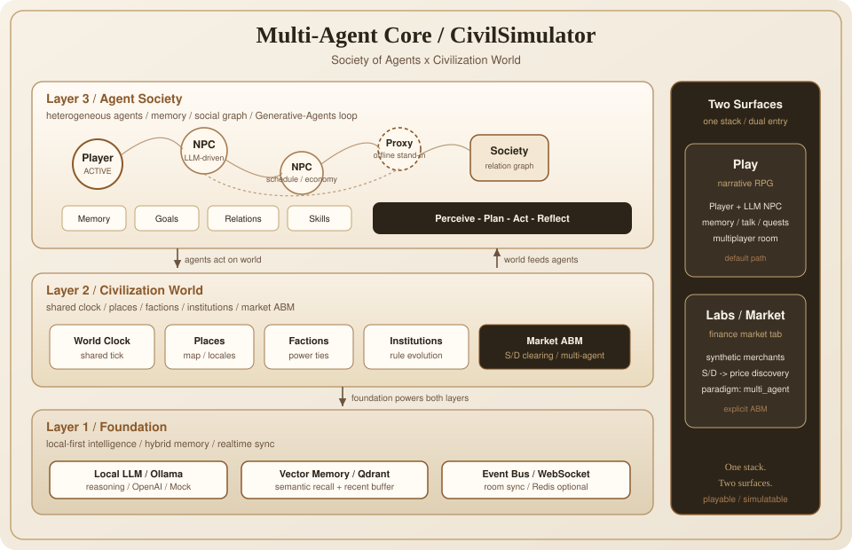

<!-- Language switch: top-left of README content -->
<p align="left">
  <strong>English</strong>
  &nbsp;|&nbsp;
  <a href="./README.zh-CN.md">中文</a>
</p>

<p align="center">
  
</p>

<p align="center">
  <a href="https://github.com/OCTPRISM/CivilSimulator/releases/tag/v0.4.0"></a>
  
  
</p>

<p align="center">
  <a href="./docs/deploy-tech-preview.md">30-min setup</a>
  ·
  <a href="./CHANGELOG.md">Changelog</a>
</p>

<p align="center">
  
  &nbsp;
  
  &nbsp;
  
</p>
<p align="center">
  <sub>Ancient · Wuxia · Sci-fi — same frame, different worlds</sub>
</p>

---

<h1 align="center">CivilSimulator</h1>

<p align="center">
  <em>A playable civilization game — and a hands-on society simulation sandbox.</em>
</p>

<p align="center">
  Pick a world, step into a character, explore in 3D, and act with friends.<br />
  Or open the labs and run controllable experiments on population, markets, and public opinion.<br />
  Local LLM · walkable 3D · same-machine multiplayer.
</p>

## Play it as a game

CivilSimulator is built first as a **free-roam narrative RPG**, not a chat demo:

| Gameplay | What you do |
|----------|-------------|
| **Choose a world / create a character** | Built-in ancient, wuxia, sci-fi seeds — or design custom civilization rules and start |
| **Walk the 3D scene** | WASD movement, talk to nearby NPCs, advance with choices or free-text actions |
| **Grow through skills & quests** | Skills, inventory, and task lines unfold as you play; system menu toggles TTS / BGM / scene art |
| **Co-op the same world** | Copy an invite link; friends join the same room and control their own characters |
| **Shape the situation** | Schedule world events or new NPCs, jump to a tick, rewrite the state of play |

Best for players who want immersion, sandbox exploration, and co-op in a living world.  
Power users can open the **Labs** for numeric what-if experiments on society.

## Run it as a society simulation

The home **Labs** surface (`/labs`) turns civilization into a **reproducible sandbox**. Shared loop: set background & events → simulate paths → export reports.

| Lab | What you simulate |
|-----|-------------------|
| **Population** | Disasters, migration, cognition, and long-run structural change |
| **Finance / economy** | Macro paths, city finance, firm valuation, retail scenarios |
| **Public opinion** | Issue spread, polarization, and feedback loops |
| **Weather / environment** | Climate shocks, regional emissions, and policy effects |

### How you intervene

You are not limited to watching charts — inject variables and rewrite trajectories:

| Method | Where | How |
|--------|-------|-----|
| **Timeline events** | Labs | Upload or write events (shock, scandal, market hit, viral issue…), set step, re-run |
| **Controlled contrasts** | Labs | Same civilization, different event sets — compare outcomes and export reports |
| **Shocks & levers** | Finance labs | Apply market or scenario shocks; watch indicators respond |
| **In-world injection** | Play | Schedule a **world event** or **new NPC** at a tick; narrative and society shift together |
| **Time skip / sleep** | Play | Jump ahead; or sleep your character while the world keeps evolving, then wake for a briefing |
| **Character actions** | Play | Dialogue, skills, quests, free input — first-person pressure on relationships and outcomes |

One line: **tune parameters in the labs; change destinies in the game** — research, teaching, or play.

## What else you get

- **Local intelligence**: Ollama by default; Mock mode for offline flow demos  
- **Create civilizations**: Edit rules, places, and factions; start from your own setup (M4)  
- **Atmosphere layer**: Scene art, browser TTS, procedural BGM  
- **Optional 3D generation**: Local Hunyuan3D pipeline; browse static assets when offline  
- **Continue after restart (Scheme B preview)**: Snapshots on exit / periodic ticks; resume from **My Worlds**

## 30-minute setup

Full steps: [Tech Preview deploy guide](./docs/deploy-tech-preview.md).

```bash
# Backend (:8000)
cd backend
python -m venv .venv && source .venv/bin/activate
pip install -r requirements.txt
cp .env.example .env
uvicorn app.main:app --reload --port 8000

# Frontend (:3000) — separate terminal
cd frontend
cp .env.example .env.local
npm install && npm run dev
```

Open http://localhost:3000 → register / sign in → start **Civil Simulator**, or open **Labs** for society simulation.

| Goal | How |
|------|-----|
| Full local LLM | Install [Ollama](https://ollama.com), pull `qwen3.8:27b` and `nomic-embed-text` |
| No GPU / flow first | Set `LLM_PROVIDER=mock` in backend `.env` |
| Production-like | `ENV=production` and a custom `AUTH_SECRET` |

Env templates: [`backend/.env.example`](./backend/.env.example), [`frontend/.env.example`](./frontend/.env.example). Ports: **8000 / 3000**.

### Resource cost if fully commercialized (planning estimate)

This section is **not** about running the Tech Preview on your laptop. It estimates what a **public, multi-tenant commercial product** (roadmap toward `v1.0`: durable worlds, multi-worker rooms, accounts, SLA) would consume. Figures are **order-of-magnitude** for capacity planning; real bids depend on region, LLM vendor, and concurrency.

**Cost stack (what you pay for)**

| Layer | Role in a commercial deployment | Typical share of OpEx |
|-------|----------------------------------|------------------------|
| **LLM inference** | Every Play step / NPC talk / lab narrative call | **Dominant** — often **~60–80%** of variable cost |
| **Realtime app tier** | FastAPI + WebSocket rooms, sticky routing, Redis pub/sub (v0.4+) | Mid — scales with **concurrent rooms**, not registered users |
| **Data plane** | Managed Postgres (or equiv.), object storage for snapshots/assets, vector DB (Qdrant) | Mid — grows with **saved worlds × retention** |
| **Edge / web** | Next.js (SSR/static) + CDN for JS/GLB/media | Low–mid |
| **Optional media** | Cloud TTS, scene art, Hunyuan3D-class generation | Spike / on-demand; can stay off for core SKU |
| **Ops** | Multi-AZ, backups, observability, abuse/rate limits, support | Fixed floor + growth |

**Capacity sketches (illustrative)**

| Commercial stage | Concurrent live rooms (rule of thumb) | Infra shape (excluding LLM $) | LLM note |
|------------------|----------------------------------------|-------------------------------|----------|
| **Invite / early paid** | ~50–200 | 2–4 API/WS nodes · Redis · small managed DB · CDN | Prefer **API LLM** (OpenAI-class) or a **small GPU pool**; budget for **tokens per page × rooms × sessions/day** |
| **Public launch** | ~500–2 000 | HA API/WS behind LB · Redis cluster · HA DB · object store · vector DB | Self-host ~27B-class models ⇒ **multi-GPU fleet** (or equivalent reserved inference); API path trades CapEx for OpEx |
| **Scale-up** | 2 000+ | Horizontal WS shards by room · stronger isolation · regional failover | LLM and memory retrieval become the binding constraint; expect dedicated inference + caching |

**Rough variable drivers (for finance models)**

- **Per active player-hour**: mainly LLM tokens (narration + dialogue + optional sim ticks) + a thin slice of WS/CPU.  
- **Per saved world**: snapshot/event storage (GB-months) + embeddings if memory is on.  
- **Per new custom 3D asset** (if offered): one-shot GPU minutes — keep as a **premium add-on**, not the base SKU.

**What is *not* required for commercialization of core Play**

- Local Ollama on each user’s PC  
- Hunyuan3D in the critical path  
- Bit-perfect simulation replay  

Tech Preview today remains **single-process / invite-local**; the table above is the **commercial target architecture**, not current default install cost. For local tryout: `LLM_PROVIDER=mock` is enough to walk the UI; optional Ollama is a developer convenience.

### Invite a second player

1. In Play, click **Invite** and copy the link  
2. They sign in, open `/join/{sessionId}`, and create a character  
3. Each acts independently; disconnect only affects their own character  

## Known limits (read first)

This is a **Tech Preview**:

| Limit | Notes |
|-------|-------|
| Continue (Scheme B) | Exit / periodic / shutdown writes snapshots; resume from **My Worlds** after restart (MVP: **playable**, not bit-perfect; very old / corrupt snapshots may fail) |
| Single process | Same-world multiplayer defaults to one uvicorn; optional `REDIS_URL` relays room events (degrades if unreachable) |
| Not a public GA | Local / invite-only; not open internet registration |
| Generator optional | Hunyuan3D offline is labeled; does not block core play |
| Hardware / OpEx | Local preview is light; **commercial** OpEx is LLM-dominated — see **Resource cost if fully commercialized** |

Roadmap: [Release plan](./wiki/v0.1-release-plan.md).

## Versions

| Version | Status | One-liner |
|---------|--------|-----------|
| **[v0.1.0-tech-preview](https://github.com/OCTPRISM/CivilSimulator/releases/tag/v0.1.0-tech-preview)** | Released | Playable + auth gates (core: secure invite play) |
| **[v0.2.0](https://github.com/OCTPRISM/CivilSimulator/releases/tag/v0.2.0)** | Released | My Worlds, onboarding, clearer errors |
| **[v0.3.0](https://github.com/OCTPRISM/CivilSimulator/releases/tag/v0.3.0)** | Released | Resume after restart (Scheme B) |
| **[v0.4.0](https://github.com/OCTPRISM/CivilSimulator/releases/tag/v0.4.0)** | Released | Operable multiplayer (kick / caps / reconnect; optional Redis) |
| **v0.5.0** | Planned | Production hardening → limited public preview |
| **v1.0.0** | Vision | Multi-tenant commercial readiness |

Every tagged release must **cold-start and complete the main play path** (see [release plan §2](./wiki/v0.1-release-plan.md)).

Done: M0 skeleton · M1 local LLM/Qdrant · M2 multiplayer room · M3 atmosphere media · M4 custom civilizations.

## Multi-Agent Core

Living worlds and lab markets share one **three-layer multi-agent stack** — not a chat wrapper around a single prompt.

<p align="center">
  
</p>

| Layer | Role |
|-------|------|
| **L3 Agent Society** | Player / NPC / Proxy agents with memory, goals, relations, skills; loop **Perceive → Plan → Act → Reflect** |
| **L2 Civilization World** | Shared clock, places, factions, institutions, and **Market ABM** clearing |
| **L1 Foundation** | Local LLM (Ollama), hybrid vector memory (Qdrant), WebSocket event bus |

**Two surfaces, same stack**

| Surface | How you use multi-agent |
|---------|-------------------------|
| **Play** | Open a world — you are a Player agent; NPCs are LLM agents; friends join as peers in one room |
| **Labs → Finance → Market** | Explicit ABM: synthetic merchant agents supply/demand → inventory pressure → price discovery (`paradigm: multi_agent`) |

Finance tabs *global / city / corporate / retail* are structural/macro paths — **not** multi-agent. Only **Market** is. See [Finance lab](./wiki/finance-lab.md).

## Stack

- **Backend** FastAPI + WebSocket (Play / rooms require login + membership)  
- **Frontend** Next.js 14 + React Three Fiber  
- **Intelligence** Ollama (or OpenAI / Mock) + optional Qdrant  
- **Agents** `backend/app/layer3_agents/` · Market ABM `layer2_civilization/finance.py`

```
CivilSimulator/
├── backend/     # API, world rooms, civilizations, labs
├── frontend/    # Play / create / invite / Labs / Generator
├── docs/        # Deploy & tech specs
└── wiki/        # Milestones & release roadmap
```

## Docs & verification

| Doc | Purpose |
|-----|---------|
| [Deploy guide](./docs/deploy-tech-preview.md) | Start + smoke |
| [Finance lab](./wiki/finance-lab.md) | Economic sandbox entry |
| [Release plan](./wiki/v0.1-release-plan.md) | Progress & five-version plan |
| [CHANGELOG](./CHANGELOG.md) | Version history |
| [Wiki index](./wiki/README.md) | M1–M4 topics |
| [Tech docs index](./docs/README.md) | UI / API specs |

```bash
cd backend && source .venv/bin/activate
QDRANT_ENABLED=false LLM_PROVIDER=mock pytest tests/ -q
```

<p align="center">
  <sub>Tech Preview · local-first · game + simulation still evolving</sub>
</p>
