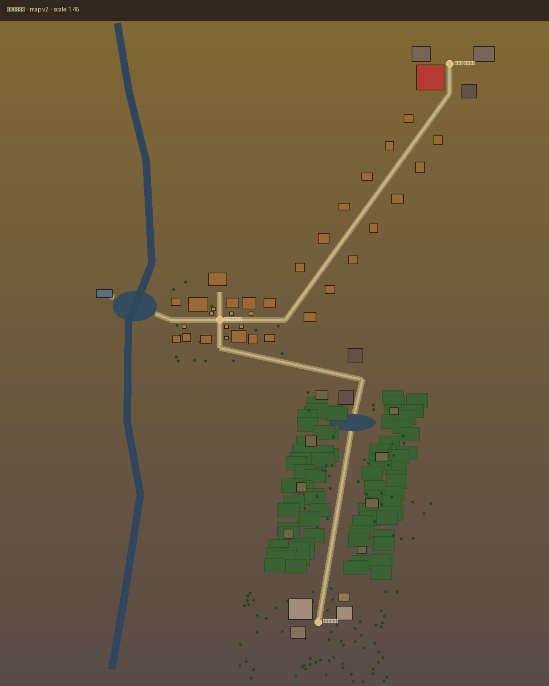
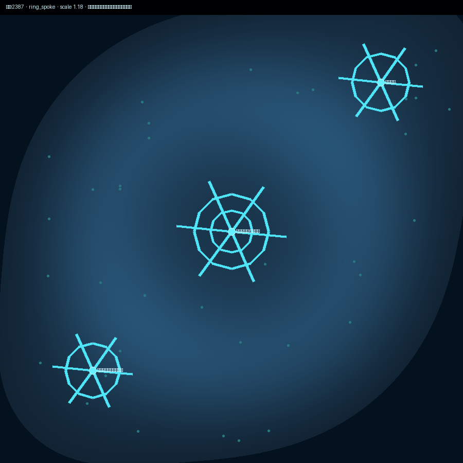

<p align="center">
  
</p>

<h1 align="center">文明模拟器 · CivilSimulator</h1>

<p align="center">
  <em>把「读小说」变成「活在小说里」。</em>
</p>

<p align="center">
  选一个文明世界，成为其中的人。<br />
  与 NPC 和其他玩家共同演化故事——本地大模型驱动，3D 可漫步。
</p>

<p align="center">
  <a href="https://github.com/OCTPRISM/CivilSimulator/releases/tag/v0.1.0-tech-preview"></a>
  
  
</p>

<p align="center">
  <strong>开发者</strong> Zhongjiang Yao
  ·
  <a href="./docs/deploy-tech-preview.md">30 分钟起服</a>
  ·
  <a href="./CHANGELOG.md">更新日志</a>
</p>

<p align="center">
  
  
  
</p>

---

## 你能做什么

- **沉浸叙事**：选内建文明或自定义规则，生成角色，用行动与对话推进剧情  
- **3D 漫游**：在可探索世界中移动、靠近 NPC、完成任务  
- **同机多人**：邀请好友加入同一世界，各自操控自己的角色（单机进程）  
- **本地智能**：默认对接 Ollama；也可 Mock 离线演示  
- **氛围层**：场景插画、浏览器朗读、程序化 BGM（系统菜单可开关）  
- **创造文明**：编辑规则、地点与势力，用自己的设定开局  

实验室（金融等）与 3D 资产生成器为**可选进阶入口**，不挡主循环。

---

## 30 分钟起服

详细步骤与排错见 [Tech Preview 部署指南](./docs/deploy-tech-preview.md)。

```bash
# 后端（:8000）
cd backend
python -m venv .venv && source .venv/bin/activate
pip install -r requirements.txt
cp .env.example .env
uvicorn app.main:app --reload --port 8000

# 前端（:3000）— 另开终端
cd frontend
cp .env.example .env.local
npm install && npm run dev
```

打开 http://localhost:3000 → 注册 / 登录 → 选文明 → 进入世界。

| 想这样跑 | 怎么做 |
|----------|--------|
| 完整本地 LLM | 安装 [Ollama](https://ollama.com)，拉取 `qwen3.8:27b` 与 `nomic-embed-text` |
| 无 GPU / 先看流程 | 后端 `.env` 设 `LLM_PROVIDER=mock` |
| 生产式起服 | `ENV=production` 且必须自定义 `AUTH_SECRET`（默认密钥会拒绝启动） |

环境变量说明见 [`backend/.env.example`](./backend/.env.example) 与 [`frontend/.env.example`](./frontend/.env.example)。默认端口：**后端 8000 / 前端 3000**。

### 邀请第二位玩家

1. Play 页点击 **邀请**，复制链接  
2. 对方登录后打开 `/join/{sessionId}` 并创建角色  
3. 双方各自行动；断线只影响自己的角色  

---

## 已知限制（请先读）

本版本是 **Tech Preview**，诚实边界如下：

| 限制 | 说明 |
|------|------|
| 活世界不持久 | **重启后端后，当前会话无法续玩**（事件日志可保留，活房间在内存中） |
| 单机进程 | 多人同世界依赖同一 uvicorn；尚未做 Redis / 多 worker |
| 非公开正式版 | 不适合无门槛公网开放注册；适合本机与熟人邀测 |
| 生成器可选 | Hunyuan3D 未启动时标「离线」，仍可浏览静态资产，不阻塞主玩法 |
| 硬件 | 真 LLM 路径建议桌面机 + 足够内存；Mock 可在轻量环境演示主流程 |

完整规划与下一版本见 [Release 开发文档](./wiki/v0.1-release-plan.md)。

---

## 版本与路线

| 版本 | 状态 | 一句话 |
|------|------|--------|
| **[v0.1.0-tech-preview](https://github.com/OCTPRISM/CivilSimulator/releases/tag/v0.1.0-tech-preview)** | 已发布 | 可玩 + 鉴权门禁 + 诚实短暂世界 |
| **v0.2.0** | 下一步 | 我的世界、新手引导、更清晰的错误提示 |
| **v0.3.0** | 规划 | 重启后续玩（快照恢复） |
| **v0.4.0+** | 规划 | 多人运营与生产硬化 → 迈向 v1.0 |

已完成能力里程碑：M0 骨架 · M1 本地 LLM/Qdrant · M2 多人房间 · M3 氛围多模态 · M4 自定义文明。

---

## 技术一览

六层架构（叙事 / Agent / 文明引擎 / 本地模型 / 3D UI / 持久化）的设计说明见 Wiki；实现上为：

- **后端** FastAPI + WebSocket（Play API 与房间均需登录成员校验）  
- **前端** Next.js 14 + React Three Fiber  
- **智能** Ollama（可切换 OpenAI / Mock）+ 可选 Qdrant 向量记忆  

```
CivilSimulator/
├── backend/     # API、世界房间、文明与实验室
├── frontend/    # Play / 创建 / 邀请 / Generator
├── docs/        # 部署与技术规格
└── wiki/        # 里程碑与 Release 路线
```

---

## 文档与验证

| 文档 | 用途 |
|------|------|
| [部署指南](./docs/deploy-tech-preview.md) | 起服与冒烟 |
| [Release 开发文档](./wiki/v0.1-release-plan.md) | 进度与五版规划 |
| [CHANGELOG](./CHANGELOG.md) | 版本变更 |
| [Wiki 索引](./wiki/README.md) | M1–M4 与实验室 |
| [技术文档索引](./docs/README.md) | UI / API 规格 |

```bash
cd backend && source .venv/bin/activate
QDRANT_ENABLED=false LLM_PROVIDER=mock pytest tests/ -q
```

---

<p align="center">
  <sub>Tech Preview · 本地优先 · 故事仍在演化</sub>
</p>
