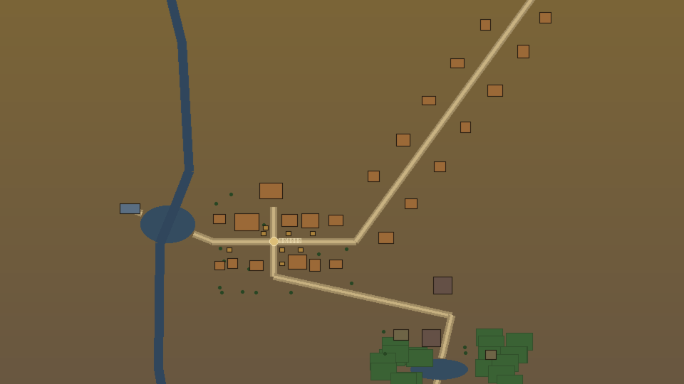
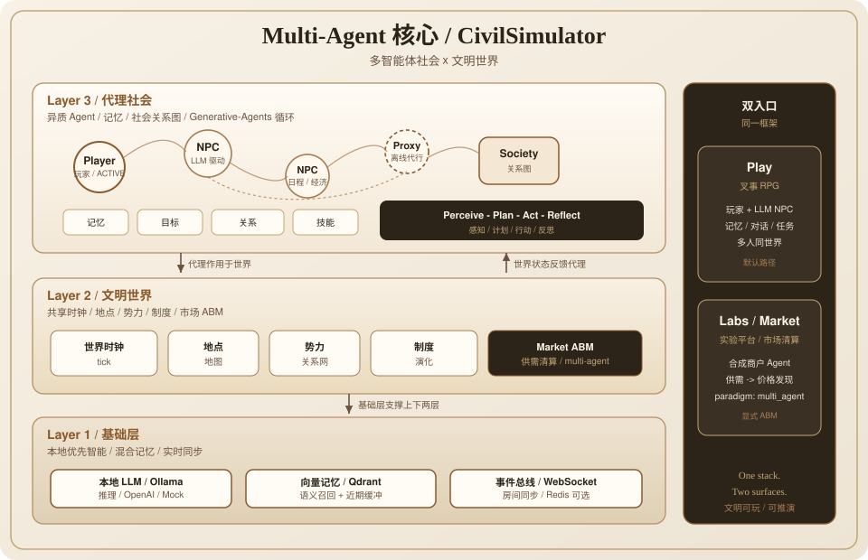

<!-- 语言开关：README 内容区左上角 -->
<p align="left">
  <a href="./README.md">English</a>
  &nbsp;|&nbsp;
  <strong>中文</strong>
</p>

<p align="center">
  
</p>

<p align="center">
  <a href="https://github.com/OCTPRISM/CivilSimulator/releases/tag/v0.4.0"></a>
  
  
</p>

<p align="center">
  <a href="./docs/deploy-tech-preview.md">30 分钟起服</a>
  ·
  <a href="./CHANGELOG.md">更新日志</a>
</p>

<p align="center">
  
  &nbsp;
  
  &nbsp;
  
</p>
<p align="center">
  <sub>九州 · 江湖 · 环带 — 同一画幅的世界切片</sub>
</p>

---

<h1 align="center">文明模拟器 · CivilSimulator</h1>

<p align="center">
  <em>可玩的文明游戏 —— 也是可动手干预的社会发展仿真沙盘。</em>
</p>

<p align="center">
  选一个文明世界，扮演其中的角色，在 3D 场景里行动，也能和好友同世界开黑。<br />
  或者打开实验平台，对人口、经济、舆论做可控推演。<br />
  本地大模型驱动 · 3D 可漫步 · 同机可多人。
</p>

## 当游戏来玩

文明模拟器首先是一款 **可自由行动的叙事 RPG**，不是聊天演示：

| 玩法 | 你怎么玩 |
|------|----------|
| **选世界 / 创角色** | 内建古代、武侠、科幻等种子，或用规则编辑器自定义文明后开局 |
| **走进 3D 场景** | WASD 移动，靠近 NPC 交谈，用选择支或自由输入推进下一幕 |
| **成长与任务** | 技能、背包与任务线随进程展开；系统菜单开关 TTS / BGM / 场景插画 |
| **开黑同世界** | 复制邀请链接，好友加入同一房间，各自操控自己的角色（互不串号） |
| **改写局势** | 定时注入事件或新角色、跳转到指定 tick，亲手改变战局与社会状态 |

适合：喜欢沉浸探索、沙盒行动、和朋友一起活在同一个世界里的玩家。  
进阶玩家还可以打开 **实验平台**，用数值沙盘做「如果舆情 / 灾变 / 经济冲击不同，社会会怎样」的对照实验。

## 当社会发展仿真来跑

首页 **实验平台**（`/labs`）把文明变成 **可复现沙盘**。共同流程：录入背景与事件 → 推演路径 → 导出报告。

| 实验室 | 你在仿真什么 |
|--------|----------------|
| **人口发展** | 天灾、迁移、认知与长期结构变迁对人口曲线的影响 |
| **金融 / 经济** | 宏观走势、城市金融、企业估值与散户路径的情景推演 |
| **舆情发酵** | 议题扩散、情绪极化与舆论场反馈回路 |
| **气象 / 环保** | 气候扰动、区域排放与治理措施效果 |

### 如何干预事态发展

你不是只能旁观曲线——可以注入变量、改写路径：

| 方式 | 场景 | 做法 |
|------|------|------|
| **时间线事件** | 实验平台 | 上传/手写事件（灾变、丑闻、市场冲击、舆论热点…），设定发生步点后重新推演 |
| **对照实验** | 实验平台 | 同一文明、不同事件组合，对比人口 / 舆情 / 金融等结果并导出报告 |
| **冲击与变量** | 金融等实验室 | 施加市场或情景冲击，观察指标响应与路径差异 |
| **世界内注入** | Play | 预约在某一 tick **注入世界事件**或 **新 NPC**，让叙事与社会状态一起转向 |
| **跳时 / 休眠** | Play | 快进到指定 tick；或休眠角色让世界后台继续演化后再「醒来」听取简报 |
| **角色行动** | Play | 对话、技能、任务与自由输入——以第一人称撬动局势与人际关系 |

一句话：**实验室里干预参数，游戏里干预命运**——研究、教学、爽玩都可以。

## 你还能做什么

- **本地智能**：默认 Ollama；也可 Mock 离线演示主流程  
- **创造文明**：编辑规则、地点与势力，用自己的设定开局（M4）  
- **氛围层**：场景插画、浏览器朗读、程序化 BGM  
- **可选 3D 生成**：Hunyuan3D 本地管线；离线时仍可浏览静态资产  
- **重启后续玩（方案 B 预览）**：退出 / 周期写快照；可在「我的世界」续玩  

## 30 分钟起服

详细步骤见 [Tech Preview 部署指南](./docs/deploy-tech-preview.md)。

```bash
# 后端（:8000）
cd backend
python -m venv .venv && source .venv/bin/activate
pip install -r requirements.txt
cp .env.example .env
uvicorn app.main:app --reload --port 8000

# 前端（:3000）— 另开终端
cd frontend
cp .env.example .env.local
npm install && npm run dev
```

打开 http://localhost:3000 → 注册 / 登录 → 选 **文明模拟器** 开玩，或进 **实验平台** 做社会仿真。

| 想这样跑 | 怎么做 |
|----------|--------|
| 完整本地 LLM | 安装 [Ollama](https://ollama.com)，拉取 `qwen3.8:27b` 与 `nomic-embed-text` |
| 无 GPU / 先看流程 | 后端 `.env` 设 `LLM_PROVIDER=mock` |
| 生产式起服 | `ENV=production` 且必须自定义 `AUTH_SECRET` |

环境变量见 [`backend/.env.example`](./backend/.env.example)、[`frontend/.env.example`](./frontend/.env.example)。端口：**8000 / 3000**。

### 完全商业化后的资源开销（规划估算）

本节**不是**本机跑 Tech Preview 的配置说明，而是估算做成 **面向公众的多租户商业产品**（路线图迈向 `v1.0`：稳定续档、多 worker 房间、账户与 SLA）时要准备的资源。数字为**数量级规划**，实际报价随区域、模型供应商与并发而变。

**成本结构（钱主要花在哪）**

| 层级 | 商业化部署中的作用 | 在运营成本中的大致占比 |
|------|--------------------|------------------------|
| **大模型推理** | 每次 Play 推进 / NPC 对话 / 实验室叙事调用 | **主成本** — 常占可变成本约 **60–80%** |
| **实时应用层** | FastAPI + WebSocket 房间、粘滞路由、Redis 广播（v0.4+） | 中等 — 随 **同时在线房间数** 伸缩，不是注册用户数 |
| **数据平面** | 托管 Postgres（或同类）、快照/资产对象存储、向量库（Qdrant） | 中等 — 随 **存档世界数 × 保留周期** 增长 |
| **边缘 / Web** | Next.js（SSR/静态）+ CDN（JS / GLB / 媒体） | 低～中 |
| **可选多模态** | 云端 TTS、场景插画、类 Hunyuan3D 生成 | 尖峰 / 按需；核心 SKU 可不做 |
| **运维** | 多可用区、备份、可观测性、防滥用与限流、客服 | 固定底盘 + 随规模上涨 |

**容量示意（便于排期与预算）**

| 商业阶段 | 同时在线活房间（经验量级） | 应用基础设施形态（不含模型账单） | 大模型说明 |
|----------|----------------------------|-----------------------------------|------------|
| **邀测 / 早期付费** | 约 50–200 | 2–4 台 API/WS · Redis · 小型托管库 · CDN | 优先 **云 API 模型**，或小规模 GPU 池；按 **每幕 token × 房间 × 日活跃场次** 做预算 |
| **公开上线** | 约 500–2 000 | LB 后高可用 API/WS · Redis 集群 · 高可用库 · 对象存储 · 向量库 | 自建约 27B 级模型 ⇒ 需 **多卡推理集群**（或等价托管推理）；走 API 则用 OpEx 换 CapEx |
| **规模化** | 2 000+ | 按房间分片的 WS · 更强租户隔离 · 区域容灾 | 推理与记忆检索成为瓶颈；需独立推理与缓存层 |

**财务模型里的主要变量**

- **每位活跃玩家·小时**：主要是 LLM token（叙事 + 对话 + 可选仿真 tick），外加少量 WS/CPU。  
- **每个存档世界**：快照/事件存储（GB·月）+ 开启记忆时的向量写入。  
- **每次新 3D 资产生成**（若商业化提供）：一次性 GPU 分钟 — 建议做成 **增值项**，不要绑进基础套餐。

**商业化核心玩法不依赖的部分**

- 要求终端用户本机安装 Ollama  
- 把 Hunyuan3D 放进关键路径  
- bit-perfect 仿真回放  

当前仓库仍是 **单进程 / 本地·熟人邀测** Tech Preview；上表描述的是 **商业化目标架构下的资源账**，不是默认安装成本。本机试用：`LLM_PROVIDER=mock` 即可走通 UI；Ollama 仅作开发便利。

### 邀请第二位玩家

1. Play 页点击 **邀请**，复制链接  
2. 对方登录后打开 `/join/{sessionId}` 并创建角色  
3. 双方各自行动；断线只影响自己的角色  

## 已知限制（请先读）

本版本是 **Tech Preview**：

| 限制 | 说明 |
|------|------|
| 续玩（方案 B） | 退出 / 周期 / 关进程会写快照；重启后可从「我的世界」续玩（MVP：**可玩**，非 bit-perfect；极旧/损坏快照可能无法恢复） |
| 单机进程 | 多人同世界默认单 uvicorn；可选 `REDIS_URL` 中继房间事件（不可达自动降级） |
| 非公开正式版 | 适合本机与熟人邀测，不适合无门槛公网开放注册 |
| 生成器可选 | Hunyuan3D 未启动时标「离线」，不阻塞主玩法 |
| 硬件 / 运营成本 | 本机预览很轻；**完全商业化**时成本由大模型主导 — 见 **完全商业化后的资源开销** |

下一版规划见 [Release 开发文档](./wiki/v0.1-release-plan.md)。

## 版本与路线

| 版本 | 状态 | 一句话 |
|------|------|--------|
| **[v0.1.0-tech-preview](https://github.com/OCTPRISM/CivilSimulator/releases/tag/v0.1.0-tech-preview)** | 已发布 | 可玩 + 鉴权门禁（核心：安全邀测开玩） |
| **[v0.2.0](https://github.com/OCTPRISM/CivilSimulator/releases/tag/v0.2.0)** | 已发布 | 我的世界、新手引导、更清晰的错误提示 |
| **[v0.3.0](https://github.com/OCTPRISM/CivilSimulator/releases/tag/v0.3.0)** | 已发布 | 重启后续玩（方案 B） |
| **[v0.4.0](https://github.com/OCTPRISM/CivilSimulator/releases/tag/v0.4.0)** | 已发布 | 多人可运营（人数/踢人/重连；可选 Redis） |
| **v0.5.0** | 规划 | 生产硬化 → 有限公网预览 |
| **v1.0.0** | 远景 | 多租户商业化就绪 |

每个 Git tag 发布前必须 **冷启动成功且主路径可玩**（见 [Release 开发文档 §2](./wiki/v0.1-release-plan.md)）。

已完成：M0 骨架 · M1 本地 LLM/Qdrant · M2 多人房间 · M3 氛围多模态 · M4 自定义文明。

## Multi-Agent 核心

可玩世界与实验室市场，共用同一套 **三层多智能体栈**——不是单次 prompt 包一层聊天壳。

<p align="center">
  
</p>

| 层级 | 职责 |
|------|------|
| **L3 代理社会** | Player / NPC / Proxy；记忆、目标、关系、技能；循环 **感知 → 计划 → 行动 → 反思** |
| **L2 文明世界** | 共享时钟、地点、势力、制度，以及 **Market ABM** 清算 |
| **L1 基础层** | 本地 LLM（Ollama）、混合向量记忆（Qdrant）、WebSocket 事件总线 |

**同一框架 · 两个入口**

| 入口 | 怎么用到 multi-agent |
|------|----------------------|
| **Play** | 开局即进入：你是玩家 Agent，NPC 是 LLM Agent；好友同房间各自操控 |
| **实验平台 → 金融 → 市场清算** | 显式 ABM：合成商户供需 → 库存压力 → 价格发现（`paradigm: multi_agent`） |

金融其它 Tab（global / city / corporate / retail）是宏观/结构推演，**不是** multi-agent；只有 **市场清算** 才是。详见 [金融实验室](./wiki/finance-lab.md)。

## 技术一览

- **后端** FastAPI + WebSocket（Play / 房间需登录成员校验）  
- **前端** Next.js 14 + React Three Fiber  
- **智能** Ollama（可切换 OpenAI / Mock）+ 可选 Qdrant  
- **Agent** `backend/app/layer3_agents/` · 市场 ABM `layer2_civilization/finance.py`

```
CivilSimulator/
├── backend/     # API、世界房间、文明与实验室
├── frontend/    # Play / 创建 / 邀请 / Labs / Generator
├── docs/        # 部署与技术规格
└── wiki/        # 里程碑与 Release 路线
```

## 文档与验证

| 文档 | 用途 |
|------|------|
| [部署指南](./docs/deploy-tech-preview.md) | 起服与冒烟 |
| [金融实验室](./wiki/finance-lab.md) | 经济沙盘入口说明 |
| [Release 开发文档](./wiki/v0.1-release-plan.md) | 进度与五版规划 |
| [CHANGELOG](./CHANGELOG.md) | 版本变更 |
| [Wiki 索引](./wiki/README.md) | M1–M4 与更多专题 |
| [技术文档索引](./docs/README.md) | UI / API 规格 |

```bash
cd backend && source .venv/bin/activate
QDRANT_ENABLED=false LLM_PROVIDER=mock pytest tests/ -q
```

<p align="center">
  <sub>Tech Preview · 本地优先 · 游戏与仿真仍在演化</sub>
</p>
